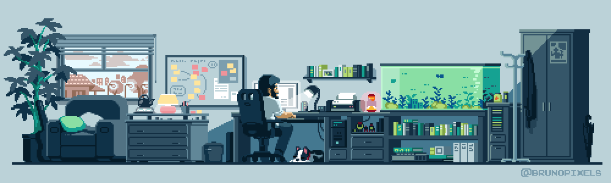

<h2 align="center">About me</h2>

  My name is Ilan, i'm 18 years old. I love learning in all areas, I currently study at the school 42 Angouleme FR.
  I plan to code in the cyberworld actually.

<h2 align="center">Contact me</h2>

  
  
  
  

<h2 align="center">Main Programming Skills</h2>

  

<h2 align="center">My Others Skills</h2>

  

<h2 align="center">Code Environments</h2>

  

<h2 align="center">Cyber world</h2>

  
  

<h2 align="center">I have already tried</h2>

  

