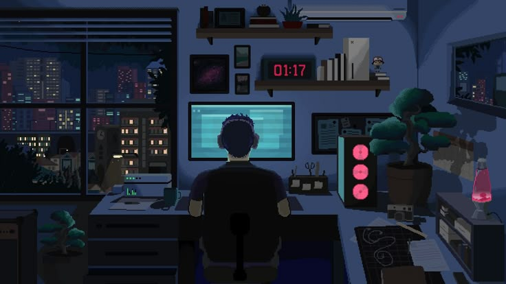

<h1> Hi, I'm Ilan </h1>
  
- I love learning in all areas

- I study at the school 42 Angouleme

- I plan to code in the cyber world or Unix

---

## Mains Programming Languages

## Other Programming Languages

## Code Environments

## Cyber World

## I have already tried

## Social

